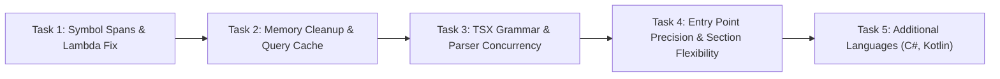

# Tree-sitter & AST Extraction Improvements Plan

> **For agentic workers:** REQUIRED SUB-SKILL: Use `superpowers:subagent-driven-development` (recommended) or `superpowers:executing-plans` to implement this plan task-by-task. Steps use checkbox (`- [ ]`) syntax for tracking.

**Goal:** Overhaul and stabilize the Tree-sitter AST extraction pipeline in CodeLens by fixing function/class line span calculations, stopping lambda parameter miscaptures, preventing WebAssembly memory leaks, resolving TSX parsing errors, caching compiled queries, refining entry-point queries, and expanding language query support.

**Architecture:** 
- In [`AstExtractService`](file:///F:/Projects/GenAi/CodeLens/src/graph/lib/ast-extract.service.ts), use definition-level node captures (`@function.def`, `@class.def`) with fallback to `node.parent` to capture accurate start-to-end lines for functions and classes, enabling [`mapAddedLinesToSymbols`](file:///F:/Projects/GenAi/CodeLens/src/review/enrichment/map-added-lines-to-symbols.util.ts) to correctly attribute modified diff lines to enclosing code symbols.
- Guarantee memory safety by wrapping parse tree lifecycles in `try ... finally { tree.delete(); }` and maintaining compiled Tree-sitter `Query` instances in a lifecycle cache rather than recompiling per file.
- Disambiguate `.tsx` from pure `.ts` in [`TreeSitterService`](file:///F:/Projects/GenAi/CodeLens/src/graph/lib/tree-sitter/tree-sitter.service.ts) using `tree-sitter-tsx.wasm` to prevent JSX syntax errors, and safeguard parser instance concurrency during parallel batch enrichment.
- Standardize `.scm` queries across TypeScript, JavaScript, Python, Go, Rust, Java, and add query bundles for C# and Kotlin.

**Tech Stack:** TypeScript, NestJS, `web-tree-sitter`, `tree-sitter-wasms`, Jest.

---

## User Review Required

> [!IMPORTANT]
> **TSX Language Identifier**: Currently, `.tsx` files are detected as language `'typescript'`. To load `tree-sitter-tsx.wasm` (preventing syntax errors on JSX), [`TreeSitterService`](file:///F:/Projects/GenAi/CodeLens/src/graph/lib/tree-sitter/tree-sitter.service.ts) will map `'tsx'` (or files ending in `.tsx`) directly to `tree-sitter-tsx.wasm` while sharing [`typescript.scm`](file:///F:/Projects/GenAi/CodeLens/src/graph/lib/queries/typescript.scm) for query loading. No breaking changes to existing review APIs will occur.

> [!NOTE]
> **Memory Management**: Calling `tree.delete()` in `AstExtractService` frees the Emscripten C tree on the WASM heap immediately after metadata extraction. This will prevent long-running server memory leaks.

---

## Open Questions

- None blocking. The queries and bindings have been tested and verified via live scripts against `node_modules/web-tree-sitter` and `node_modules/tree-sitter-wasms`.

---

## Proposed Changes

Grouped logically into 5 sequential tasks.



---

### Task 1: Fix Symbol Definition Line Bounds & Remove Lambda Query

**Problem**:
1. `c.node` in `AstExtractService.extractSymbols` captures the name token (`(identifier)`), causing `startLine === endLine` (only the declaration line). This breaks `mapAddedLinesToSymbols` for lines inside function/class bodies.
2. In `typescript.scm`, `(arrow_function (identifier) @function.name)` captures callback parameters like `n` in `items.map(n => ...)`.

#### [MODIFY] `src/graph/lib/queries/typescript.scm`
- Tag definitions with `@function.def` and `@class.def`.
- Remove `(arrow_function (identifier) @function.name)`.
- Add support for function expressions in variable declarators.
- Capture `interface_declaration` and `enum_declaration` as types/classes.

```scheme
;--- functions
(function_declaration name: (identifier) @function.name) @function.def
(method_definition name: (property_identifier) @function.name) @function.def
(variable_declarator name: (identifier) @function.name value: (arrow_function)) @function.def
(variable_declarator name: (identifier) @function.name value: (function_expression)) @function.def

;--- classes
(class_declaration name: (type_identifier) @class.name) @class.def
(abstract_class_declaration name: (type_identifier) @class.name) @class.def
(interface_declaration name: (type_identifier) @class.name) @class.def
(enum_declaration name: (identifier) @class.name) @class.def

;--- imports
(import_statement source: (string) @import.source)

;--- entry_points
(export_statement declaration: (function_declaration name: (identifier) @entry))
(export_statement declaration: (class_declaration name: (type_identifier) @entry))
```

#### [MODIFY] `src/graph/lib/queries/javascript.scm`
- Tag definitions with `@function.def` and `@class.def`.
- Add function expressions: `(variable_declarator name: (identifier) @function.name value: (function_expression)) @function.def`.

#### [MODIFY] `src/graph/lib/queries/python.scm`
- Tag definitions with `@function.def` and `@class.def`:
  ```scheme
  (function_definition name: (identifier) @function.name) @function.def
  (class_definition name: (identifier) @class.name) @class.def
  ```

#### [MODIFY] `src/graph/lib/queries/go.scm`, `rust.scm`, `java.scm`
- Tag function/method/struct/class definitions with `@function.def` and `@class.def`.

#### [MODIFY] `src/graph/lib/ast-extract.service.ts`
- Update `extractSymbols` to look for a paired `@function.def` or `@class.def` capture within the match to determine `startLine` and `endLine`.
- If no def capture is present, fall back to `node.parent ?? node` for backwards compatibility.

#### [NEW] `src/graph/lib/ast-extract.service.spec.ts`
- Unit test verifying:
  - Multi-line functions have `startLine < endLine` spanning the full body.
  - Multi-line classes span the full class body.
  - Arrow functions assigned to `const` or `let` span their bodies.
  - Inline lambda parameters in `.map(x => ...)` are NOT captured as functions.

---

### Task 2: Eliminate WASM Tree Memory Leaks & Add Query Caching

**Problem**:
1. Syntax trees created by `parser.parse()` are never freed with `tree.delete()`.
2. Queries are compiled from text strings via `new Query(...)` and deleted on every section of every file.

#### [MODIFY] `src/graph/lib/ast-extract.service.ts`
- In `buildMetadata`:
  ```ts
  const tree = await this.treeSitter.parse(languageId, code);
  if (!tree) return this.emptyMetadata(linesOfCode);
  try {
    return this.extractMetadataFromTree(lang, tree, bundle, linesOfCode);
  } finally {
    tree.delete();
  }
  ```
- Add a compiled `Query` cache `private queryCache = new Map<string, Query>()` keyed by `${languageId}:${queryType}`.
- Re-use compiled queries across parses of the same language.
- Implement NestJS `OnModuleDestroy` to loop through `this.queryCache.values()` and call `q.delete()` on application shutdown.

---

### Task 3: Support TSX Grammar & Ensure Parser Concurrency Safety

**Problem**:
1. `.tsx` files are parsed with `tree-sitter-typescript.wasm`, causing syntax errors on JSX elements.
2. `TreeSitterService` caches a single `Parser` instance per language, which can lead to state collision when files are parsed concurrently in `Promise.all`.

#### [MODIFY] `src/graph/lib/tree-sitter/tree-sitter.service.ts`
- Add `'tsx'` to `SupportedLangId`.
- In `wasmBaseByLang`, add `tsx: 'tree-sitter-tsx'`.
- In `normalizeLangId`: distinguish `'tsx'` from `'ts'` / `'typescript'`.
- In `parse(languageId, code)`: instantiate a fresh `new Parser()` (or pool) bound to the cached `Language`, parse the code, and delete the parser instance after parsing to ensure thread/concurrency safety:
  ```ts
  async parse(languageId: SupportedLangId, code: string): Promise<Tree | null> {
    const lang = await this.getLanguage(languageId);
    if (!lang) return null;
    const parser = new Parser();
    try {
      parser.setLanguage(lang);
      return parser.parse(code);
    } finally {
      parser.delete();
    }
  }
  ```

#### [MODIFY] `src/graph/lib/language-detect.service.ts`
- Update `extMap` for `.tsx` to return `'tsx'`.

#### [MODIFY] `src/graph/lib/queries/query-loader.service.ts`
- In `normalize(languageId)`: map `'tsx'` to `'typescript'` so `tsx` uses the same `.scm` query file.

---

### Task 4: Entry Point Queries Precision & Section Flexibility

**Problem**:
1. Go, Rust, and Java queries match all functions as entry points.
2. `QueryLoaderService` throws if `classes` or `imports` is empty, forcing non-OOP languages to invent dummy queries.

#### [MODIFY] `src/graph/lib/queries/query-loader.service.ts`
- In `parseBlocks`:
  - Only `functions` and `imports` should be required (or make `classes` optional with default `''`).
  - Do not throw an error if a language has no `classes`.

#### [MODIFY] `src/graph/lib/queries/go.scm`
- Replace wildcard function entry query with:
  ```scheme
  ;--- entry_points
  (function_declaration name: (identifier) @entry (#eq? @entry "main"))
  ```

#### [MODIFY] `src/graph/lib/queries/rust.scm`
- Replace wildcard function entry query with:
  ```scheme
  ;--- entry_points
  (function_item name: (identifier) @entry (#eq? @entry "main"))
  ```

#### [MODIFY] `src/graph/lib/queries/java.scm`
- Replace wildcard method entry query with:
  ```scheme
  ;--- entry_points
  (method_declaration name: (identifier) @entry (#eq? @entry "main"))
  ```

#### [MODIFY] `src/graph/lib/queries/python.scm`
- Refine entry point to target function `main` or the standard `__name__ == '__main__'` block without capturing `__name__` as an entry point name.

---

### Task 5: Add Support for Additional Languages (C# & Kotlin)

**Problem**:
`LanguageDetectService` detects `.cs` and `.kt`, and `tree-sitter-wasms` includes `tree-sitter-c_sharp.wasm` and `tree-sitter-kotlin.wasm`, but `src/graph/lib/queries/` lacks `.scm` files for them.

#### [NEW] `src/graph/lib/queries/csharp.scm`
```scheme
;--- functions
(method_declaration name: (identifier) @function.name) @function.def
(constructor_declaration name: (identifier) @function.name) @function.def
(local_function_statement name: (identifier) @function.name) @function.def

;--- classes
(class_declaration name: (identifier) @class.name) @class.def
(interface_declaration name: (identifier) @class.name) @class.def
(struct_declaration name: (identifier) @class.name) @class.def
(enum_declaration name: (identifier) @class.name) @class.def

;--- imports
(using_directive (qualified_name) @import.source)
(using_directive (identifier) @import.source)

;--- entry_points
(method_declaration name: (identifier) @entry (#eq? @entry "Main"))
```

#### [NEW] `src/graph/lib/queries/kotlin.scm`
```scheme
;--- functions
(function_declaration name: (simple_identifier) @function.name) @function.def

;--- classes
(class_declaration name: (simple_identifier) @class.name) @class.def
(object_declaration name: (simple_identifier) @class.name) @class.def

;--- imports
(import_header (identifier) @import.source)

;--- entry_points
(function_declaration name: (simple_identifier) @entry (#eq? @entry "main"))
```

---

## Verification Plan

### Automated Tests
1. **New Unit Tests**:
   - `pnpm test src/graph/lib/ast-extract.service.spec.ts`:
     - Test function span calculation: verify that a 10-line function reports `startLine: 1, endLine: 10`.
     - Test `mapAddedLinesToSymbols` integration: verify that a line inside the function body is correctly mapped to that function symbol.
     - Test lambda filtering: verify `[1, 2].map(x => x)` does not create a function symbol named `x`.
     - Test TSX component parsing: verify no syntax errors when parsing React TSX snippets.
     - Test entry points: verify only `main` is captured as an entry point for Go, Rust, Java.
     - Test C# and Kotlin parsing and symbol extraction.
2. **Existing Test Suite**:
   - `pnpm test`: Ensure all existing tests continue passing without regression.
3. **Build Check**:
   - `pnpm build`: Verify TypeScript compilation and asset packaging succeed cleanly.

### Manual Verification
- Run a benchmark script on memory usage before and after parsing 100 code snippets to confirm that WASM memory stays flat instead of growing indefinitely.
